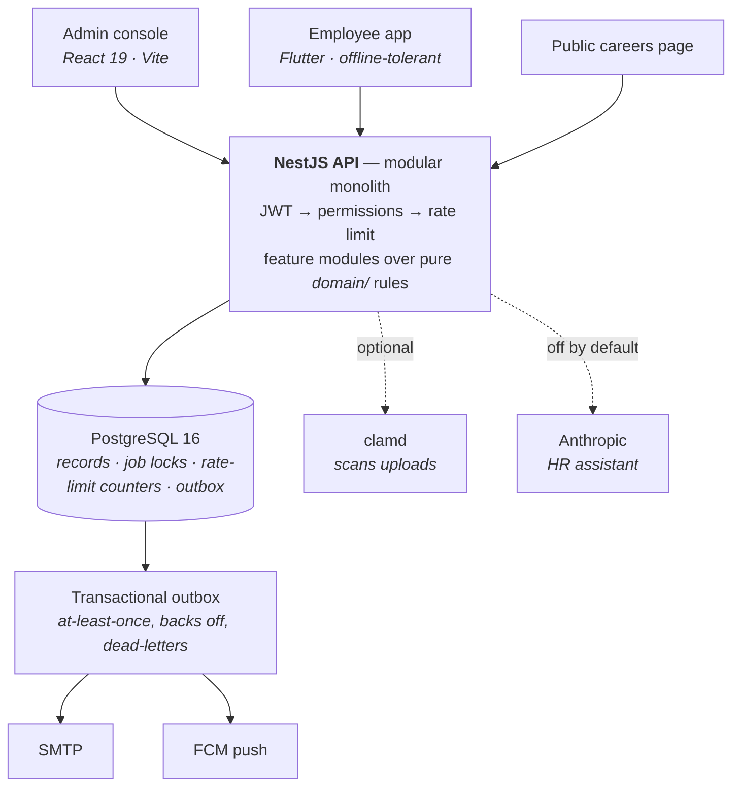

<div align="center">

# Cwork

**Open-source HR information system — people, hiring, leave, attendance, payroll,
and an HR assistant that actually knows your policies.**

Built for Thai labour practice. Designed to be self-hosted.

**English** · [ภาษาไทย](./README.th.md)

[](https://github.com/SuruchBoss/Cwork/actions/workflows/ci.yml)
[](./LICENSE)
[](./backend)
[](./web)
[](./mobile)


<sub>Real console, real second factor, real payroll run — recorded against the
company `npm run db:seed` builds, by <a href="./docs/demo/record.mjs">a script in
this repository</a>. <a href="./docs/demo/walkthrough.mp4">Higher-quality MP4</a>.</sub>

</div>

---

## What you get

Three deployables, one database:

| | |
|---|---|
| **Admin console** | React 19 + Vite. Everything HR, payroll and managers do. |
| **Employee app** | Flutter. Clock in/out, leave, payslips, approvals — offline-tolerant. |
| **API** | NestJS modular monolith over PostgreSQL 16. |



Everything a queue, a lock server and a cache would normally do, PostgreSQL does
here: `FOR UPDATE SKIP LOCKED` for the outbox, advisory locks so only one replica
runs each scheduled job, and a counter table for shared rate limits. That is the
whole reason a second instance is a setting rather than a project.

No Redis, no message broker, no Kubernetes. Running several API instances needs
one setting (`THROTTLE_STORAGE=postgres`) rather than another service to operate
— an HRIS that needs a Kafka cluster to send a leave notification is one nobody
can self-host.

**One deployment serves one organisation.** Every table carries `organizationId`
and every query filters on it, but that is defence in depth inside a single
install, not a tenant boundary: nothing in the test suite exercises two
organisations sharing a database, so nothing should depend on it.

## Try it in five minutes

```bash
git clone https://github.com/SuruchBoss/Cwork.git
cd Cwork
cp .env.example .env
```

Fill in the secrets `.env` asks for — compose refuses to start without them:

```bash
openssl rand -base64 48   # JWT_ACCESS_SECRET, JWT_REFRESH_SECRET
openssl rand -base64 32   # FIELD_ENCRYPTION_KEY
                          # plus POSTGRES_PASSWORD, anything you like
```

Then:

```bash
docker compose up -d --build
docker compose run --rm --build migrate            # apply migrations
docker compose run --rm migrate npm run db:seed    # demo data — evaluation only
```

Open **http://localhost:8080**.

The seed does not stop at an org chart: it runs last month's payroll through the
real calculator, books leave that real approvers approved, and leaves a hiring
pipeline mid-flight and two requests waiting in an inbox. Every page has
something on it, because a console full of *"nothing here yet"* tells you
nothing about whether the thing works.

| | |
|---|---|
| **As an employee** | `dev2@cwork.example` / `Cwork2026!` — password only |
| **As HR** | `hr.manager@cwork.example` / `Cwork2026!` — **plus a 2FA code** |

Admin accounts genuinely require a second factor, so `db:seed` prints a demo
TOTP secret and a QR link. Add it to any authenticator app once and every admin
account works.

> **Migrations run through the `migrate` service, not `exec api`.** The API image
> is pruned to production dependencies and ships no Prisma CLI. That service sits
> behind a compose profile, so `up` never starts it.

<details>
<summary><b>Running without Docker</b></summary>

```bash
# API — needs PostgreSQL 16 (pgvector optional)
cd backend
cp .env.example .env    # set DATABASE_URL and the secrets
npm install
npx prisma migrate deploy && npm run db:seed
npm run start:dev       # → http://localhost:3000

# Console
cd ../web
npm install && npm run dev    # → http://localhost:5173, proxies /api

# Mobile
cd ../mobile
flutter pub get
flutter run --dart-define=API_BASE_URL=http://10.0.2.2:3000/api/v1
```

The interactive API docs live at `/api/docs` whenever `NODE_ENV` is not
`production` — which is what compose defaults it to, so set
`NODE_ENV=development` in `.env` if you want them.

</details>

---

## Installing it for a real organisation

The five minutes above are demo data: a published password, a published
two-factor secret, eight fictional employees. A real install skips the seed
entirely.

```bash
docker compose up -d --build
docker compose run --rm --build migrate           # apply migrations
docker compose run --rm migrate npm run db:init   # your organisation
```

`db:init` asks for an organisation name, a timezone and the first
administrator's email, and creates exactly that: one organisation, the eight
system roles, one account. Nothing else — no departments, no demo rows, nothing
to clean up afterwards.

If the terminal is not where you want to type all that:

```bash
docker compose run --rm migrate npm run db:init -- --web
```

prints a single-use token and you finish at **http://localhost:8080/setup**.
That token is the entire security model. Minting one needs shell access to the
server, which is the one thing a stranger who finds a fresh deployment does not
have — so the wizard cannot be claimed by whoever reaches it first. It lasts an
hour and works once.

Either way the first administrator holds every permission there is, so Cwork
makes it enrol a second factor before its first session: have an authenticator
app to hand. Neither the CLI nor the wizard ever prints a TOTP secret — you
enrol it yourself, once.

Running `db:init` a second time on a database that already has an organisation
refuses, and so does `db:seed`: the demo data will not install itself beside a
real company by accident.

---

## What it does

> **The interface is Thai.** An English locale is on the
> [backlog](./docs/backlog.md) as CW-016. Every image below is a real screenshot
> of the seeded demo company — the console in a browser, the employee app on a
> 390×844 phone.

### People

Employee records with encrypted national IDs and bank accounts, an org chart,
employment history, and resignation with a clearance checklist and exit
interview.

 

### Leave

Thai statutory leave types, seniority-tiered accrual, half and hourly days, and
a balance ledger that reserves pending days — so two overlapping requests cannot
both fit inside one remaining day.

**Friday to Monday costs two days, not four.** Weekends and public holidays are
excluded, not charged.


### Attendance

Clock in/out with geofencing and anti-fraud flags, shift rosters, corrections,
and overtime at Labour Protection Act rates.

**A punch outside the fence is flagged, never rejected.** An employee must always
be able to prove they turned up; HR reviews the flag afterwards.


### Payroll

Effective-dated salary, Thai withholding tax and social security, benefits,
expense reimbursement — and payslips you can still explain a year later.

**Whoever calculates a run cannot approve it**, enforced by the API rather than
by policy.

 

### Approvals

One declarative engine serves leave, overtime, expenses, attendance corrections,
resignations, requisitions, offers, payroll runs and document requests. Policies
resolve approvers by line manager, department head, role or named user, and carry
conditions such as amount thresholds.


### Hiring, performance, documents

Requisitions through a public careers page, PDPA-consented applications,
auto-graded assessments, interviews with scorecards, and offers that convert into
employee records. Review cycles with weighted KPIs and calibration. Certificates
and letters employees can request for themselves.

  

### The HR assistant

Answers policy questions from your own documents, checks balances, and files leave
and document requests — scoped so it can only ever see the asker's own data.

**It is optional and off by default.** Policy search falls back to PostgreSQL
full-text plus trigram matching, which needs no embeddings and copes with Thai's
lack of word boundaries.

 


### The employee app

Flutter, for everyone who never opens the console. Clock in and out with
geofencing, request leave, read a payslip, approve what is waiting, ask the
assistant.

Built for a phone that loses signal: punches queue in durable storage and replay
on reconnect, carrying a client-generated id so a retry cannot become a second
punch.

   

That payslip is the "explain it a year later" claim in practice: earnings,
deductions, and employer contributions kept visibly separate from what came out
of the employee's pay.

<details>
<summary><b>More screenshots</b> — sign-in and 2FA, expenses, offboarding, org chart, audit, dark theme, phone width</summary>

<br>

**Sign-in, and the second factor an admin account cannot skip**

 

**Expenses and offboarding**

 

**Org chart and the append-only audit trail**

 

**More of the employee app** — payslips, the assistant, profile, and filing leave

   

**Dark theme, and the console at phone width**

 

</details>

---

## A few decisions worth knowing about

**Business rules are pure functions.** Leave arithmetic, attendance derivation,
Thai tax, KPI scoring and assessment grading live in `domain/` directories with
no database, no framework and no I/O. That is why 271 backend tests run in ten
seconds — and why *"why was I charged 2.5 days?"* is answered by reading one
function instead of a query plan.

**Salary is never prorated by attendance coverage.** A monthly-salaried employee
is paid the full month minus *explicit* unpaid leave and absence. Days that
simply have not been closed out — future dates, or a clock-in rollout still in
progress — must not reduce pay. Getting this wrong silently shorts people, which
is the worst class of payroll bug.

**A fresh deployment cannot be claimed by whoever finds it first.** Between
`docker compose up` and the moment setup finishes, an install is reachable and
unowned — and a scanner sweeping the port beats the person still reading startup
logs. So there is no "if no organisation exists, let anyone through": the first
administrator is created either by a CLI that needs a shell on the server, or by
a wizard holding a single-use token only that CLI can mint.

**A notification is written in the same transaction as the thing it is about.**
Approve a leave request and the row, the balance and the notification commit or
roll back together — there is no window where someone is told about a decision
that was rolled back. Delivery is a separate poll over the outbox table with
`FOR UPDATE SKIP LOCKED`, so a mail server being down cannot fail an approval.

**The audit trail is append-only in the database.** A trigger raises an exception
on `UPDATE` or `DELETE` against `audit_logs` and `attendance_punches`. A
compromised application account can add entries but cannot rewrite history.

**Privileged accounts cannot sign in with a password alone.** Anyone who can read
national IDs, run payroll or hand out permissions needs a second factor. TOTP is
implemented against RFC 6238's own test vectors rather than pulled in as a
dependency, and a code cannot be spent twice even inside its validity window.

**Uploads are scanned before they are stored.** Résumés arrive from a public
careers page — the least trusted input the system takes. The bytes go to clamd
first, so malware is never written anywhere for a later change to expose. And a
scanner that is not working is never a pass: unreachable, timed out, or a reply
that cannot be parsed all leave the file held and undownloadable.

**The assistant's tools take no employee id.** Every one resolves the subject from
the authenticated principal, so there is no parameter a prompt injection could set
to read someone else's payslip. The blast radius of a fully compromised model is
bounded by what that user could already see.
See [ADR-0004](./docs/adr/0004-assistant-tool-scoping.md).

## Repository layout

```
backend/     NestJS API — modular monolith over PostgreSQL
web/         React 19 + Vite admin console
mobile/      Flutter employee app
docs/        Spec, architecture, security, data model, API, ADRs, backlog
.github/     CI workflow, issue and pull-request templates
```

## Documentation

| | |
|---|---|
| [Specification](./docs/spec.md) | What the system does, module by module — the reference for what "correct" means |
| [Backlog](./docs/backlog.md) | Open work, prioritised, with acceptance criteria |
| [Architecture](./docs/architecture.md) | How the pieces fit, and what is deliberately absent |
| [Security](./docs/security.md) | Auth, encryption, audit — and an honest list of gaps |
| [Personal data](./docs/privacy.md) | What is held about people, for how long, and how to take it out |
| [Privacy notice (ไทย)](./docs/privacy-notice.th.md) | A draft notice to hand to employees |
| [Data model](./docs/data-model.md) | Schema patterns and the hand-written SQL |
| [API reference](./docs/api.md) | Endpoints, error codes, conventions |
| [Payroll: Thai rules](./docs/payroll-thailand.md) | Tax brackets, allowances, OT multipliers |
| [The HR assistant](./docs/ai-assistant.md) | Tools, guardrails, data flow |
| [Operations](./docs/operations.md) | Deploy, backup, scheduled jobs, the Prisma drift trap |
| [ADRs](./docs/adr/) | Decisions that were not obvious |

## Localisation

The UI is Thai, and payroll implements Thai rules — PIT withholding, social
security, Labour Protection Act overtime. Nothing in the *architecture* is
Thailand-specific: the tax rule set is data (`THAI_TAX_RULES_2026`), leave types
are configuration, and overtime multipliers are per-organisation settings. Adding
another jurisdiction means a new rule set and a translation pass, not a rewrite.

## Status

Working and verified end to end — sign-in through payroll. 271 backend unit
tests, 29 web, 35 mobile, plus a 163-check end-to-end suite that drives the real
API over HTTP in CI, and the console exercised in a real browser against the live
API.

Second-factor authentication, upload scanning, shared rate limiting and
email/push delivery are all in place. What is left is tracked in the
[backlog](./docs/backlog.md), P0 first.

**Still not production-ready without work.** Before running real payroll, read
[the gaps in docs/security.md](./docs/security.md#what-this-does-not-do). In
short: there is no way to create an organisation without loading the demo data,
no ภ.ง.ด.1 filing export, issued documents are not rendered as PDFs, the
employee app cannot register for push yet, and this code has never had a
penetration test.

**The Thai payroll and social-security rules have not been reviewed by anyone
qualified.** They were written from published sources and unit-tested against
hand-worked examples, which proves the code computes what its author believed
the rules to be — not that the belief is right. Check the figures against your
own before a real run. If you have the standing to review them properly,
[issue #36](https://github.com/SuruchBoss/Cwork/issues/36) is open for it.

## Versioning

Releases are tagged and recorded in [CHANGELOG.md](./CHANGELOG.md). Install a
tag rather than `main` if you want to be able to say which version you are
running — [the tag list](https://github.com/SuruchBoss/Cwork/tags) is the
authority on what exists:

```bash
git clone --branch <tag> https://github.com/SuruchBoss/Cwork.git
```

**This is 0.x, and breaking changes are allowed.** They will be in the changelog
with what to do about them, but there is no long-term support branch and no
promise of a painless upgrade path until 1.0. Migrations are forward-only; take
a database backup before applying any.

1.0 means the schema and the API are stable enough to promise that. It is not
close, and pretending otherwise would be the more expensive mistake.

## How this was built

**The code in this repository was written by an AI agent**, working under
direction, over a small number of days. Several commits add thousands of lines
at once. That is visible in `git log` to anyone who looks, and it changes what
you should check before trusting any of it — so it is said here rather than left
to be inferred.

What was *not* generated: the architecture, the security model, the priorities,
and the arguments behind them. Those were decided by a person, recorded as they
were settled, and are readable in
[spec.md § Agreed direction](./docs/spec.md#agreed-direction) and in the
[ADRs](./docs/adr/). Where a ticket's own premise turned out to be wrong, the
correction is written down in the backlog's Done table next to what was built —
that record is the point.

What it implies about review:

- Every suite passes, in CI, on every push — 271 backend unit tests, 29 web,
  35 mobile, 163 end-to-end checks against the real API over HTTP.
- The decisions are documented and the reasoning is recoverable.
- **No independent human has read every line.** Tests passing and a design
  being defensible are not the same thing as a review, and this has had the
  first two and not the third.

The history has not been rewritten to look otherwise, and it will not be.
Rewriting it would be the actual dishonesty.

## Contributing

Contributions welcome — see [CONTRIBUTING.md](./CONTRIBUTING.md). The
[backlog](./docs/backlog.md) is the list of open work, with the ones marked
*good first issue* called out; they tend to be leave-policy variants, payroll edge
cases, or a jurisdiction other than Thailand.

Commits need a sign-off (`git commit -s`) under the
[Developer Certificate of Origin](./DCO) — a statement that you had the right to
submit the change, checked in CI. **There is no CLA**: a contributor licence
agreement is a barrier in front of a one-line fix, and the DCO answers the
question a CLA is usually reached for. The accepted consequence is that the
licence cannot realistically be changed later, since that would need every
contributor's agreement. Apache-2.0 is the answer, for good.

## Licence

[Apache 2.0](./LICENSE).
