# นำข้อมูลจาก Excel เข้า Cwork

คู่มือสำหรับฝ่ายบุคคล ใช้ตอนเริ่มใช้ Cwork ครั้งแรก เพื่อนำรายชื่อพนักงาน วันลาที่ใช้ไปแล้ว
และยอดเงินเดือนที่จ่ายไปแล้วในปีนี้ เข้าระบบจากไฟล์ Excel โดยไม่ต้องพิมพ์ทีละคน

ทั้งสามหน้าทำงานเหมือนกัน คือ ดาวน์โหลดแบบฟอร์ม กรอก อัปโหลด แล้วระบบจะตรวจไฟล์ให้ก่อน
**ระหว่างที่ไฟล์ยังมีจุดผิด ระบบจะไม่บันทึกอะไรเลย** จึงลองอัปโหลดได้หลายรอบโดยไม่ต้องกลัวข้อมูลเสีย

## ก่อนเริ่ม

- ทำตามลำดับนี้: **1. พนักงาน → 2. วันลาที่ใช้ไปแล้ว → 3. ยอดเงินเดือนก่อนใช้ Cwork**
  เพราะแบบฟอร์มของข้อ 2 และ 3 ดึงรายชื่อพนักงานจากข้อ 1 มาให้
- ข้อ 3 ทำเฉพาะเมื่อบริษัทจะคำนวณเงินเดือนใน Cwork เท่านั้น
- ปุ่มนำเข้าจะขึ้นเฉพาะบัญชีที่มีสิทธิ์ทำงานนั้น ถ้าไม่เห็นปุ่ม ให้ติดต่อผู้ดูแลระบบ
- ไฟล์หนึ่งไฟล์มีได้ไม่เกิน 2,000 แถว
- บันทึกไฟล์เป็น `.xlsx` หรือ CSV ก็ได้ CSV จาก Excel ภาษาไทยก็ใช้ได้ ภาษาไทยไม่เพี้ยน
- ตอนนี้หน้าจอยังแสดงปีเป็น ค.ศ. (เช่น 2026 คือ 2569) แต่ในไฟล์กรอกเป็น พ.ศ. หรือ ค.ศ. ก็ได้

---

## 1. นำเข้าพนักงาน

### เปิดหน้า

ไปที่เมนู **ทะเบียนพนักงาน** แล้วกดปุ่ม **นำเข้าจากไฟล์ Excel** ที่มุมขวาบน

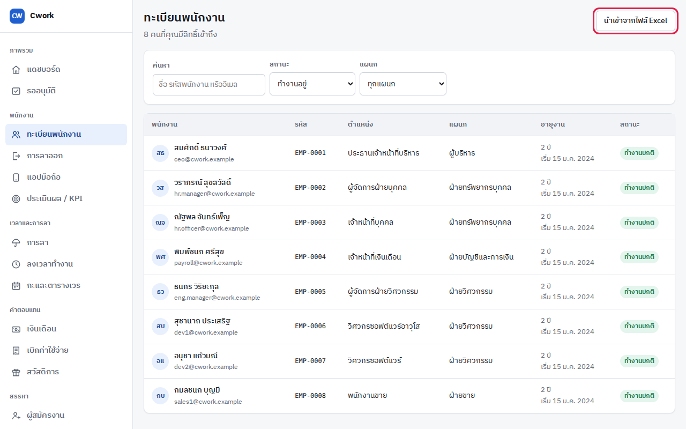

### ขั้นที่ 1 ดาวน์โหลดแบบฟอร์ม

กด **แบบฟอร์มภาษาไทย** จะได้ไฟล์ Excel สองชีต

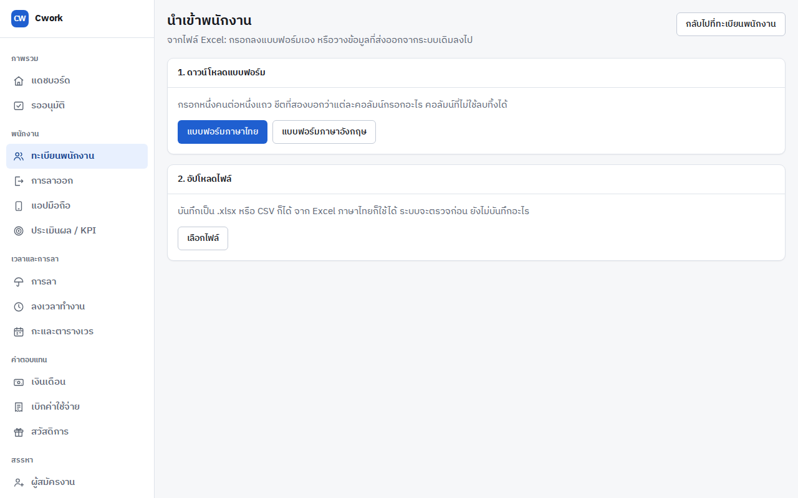

- **ชีตแรก** คือที่กรอกข้อมูล กรอกหนึ่งคนต่อหนึ่งแถว
- **ชีตที่สอง** อธิบายว่าแต่ละคอลัมน์ต้องกรอกอะไร
- คอลัมน์ที่มี `*` ต้องกรอก ได้แก่ **รหัสพนักงาน ชื่อ นามสกุล วันเริ่มงาน**
  ส่วนแรงงานต่างด้าวที่ไม่มีชื่อภาษาไทย เว้นชื่อและนามสกุลภาษาไทยไว้ แล้วกรอก
  **ชื่อ (อังกฤษ)** กับ **นามสกุล (อังกฤษ)** แทนได้ และไม่ต้องมีเลขบัตรประชาชน
- คอลัมน์ที่ไม่ใช้ลบทิ้งได้ แต่**ห้ามเปลี่ยนชื่อหัวคอลัมน์**

ข้อควรระวังตอนกรอก:

| เรื่อง | วิธีที่ถูก |
|---|---|
| วันที่ | เช่น `15/1/2567` หรือ `2024-01-15` ปี พ.ศ. หรือ ค.ศ. ก็ได้ |
| รหัสเครื่องสแกนนิ้ว | พิมพ์ให้ตรงกับที่เครื่องแสดง เช่น `007` ไม่ใช่ `7` |
| เลขบัตรประชาชน | 13 หลัก มีขีดหรือเว้นวรรคได้ |
| แรงงานต่างด้าว | กรอก **เลขพาสปอร์ต** **วันหมดอายุพาสปอร์ต** **เลขใบอนุญาตทำงาน** และ **วันหมดอายุใบอนุญาตทำงาน** ได้ เลขทั้งสองระบบเก็บแบบเข้ารหัส |
| แผนก ตำแหน่ง สถานที่ทำงาน | ต้องตรงกับรหัสหรือชื่อที่มีอยู่ในระบบแล้ว ถ้ายังไม่มี ให้เพิ่มที่เมนู **โครงสร้างองค์กร** ก่อน แล้วค่อยอัปโหลดไฟล์ (ดู "ปัญหาที่เจอบ่อย") |
| ข้อมูลจากระบบเดิม (เช่น Odoo) | คัดลอกมาวางในชีตแรกได้ แต่หัวคอลัมน์ต้องเป็นชื่อเดียวกับในแบบฟอร์ม |

### ขั้นที่ 2 อัปโหลดไฟล์

กด **เลือกไฟล์** แล้วเลือกไฟล์ที่กรอกเสร็จ ระบบจะตรวจทั้งไฟล์ภายในไม่กี่วินาที

### ขั้นที่ 3 แก้จุดที่ผิด (ถ้ามี)

ถ้ามีจุดผิด ระบบจะแสดงทุกจุดในครั้งเดียว บอก**แถว** **คอลัมน์** (ตัวอักษรเดียวกับใน Excel)
และ**ปัญหา**

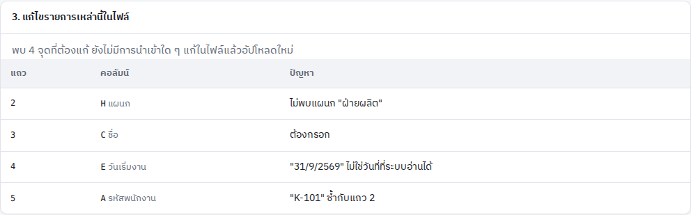

เปิดไฟล์ใน Excel แก้ตามรายการ บันทึก แล้วกด **เลือกไฟล์** อีกครั้ง

> ถ้าเลือกไฟล์เดิมซ้ำแล้วหน้าจอไม่เปลี่ยน ให้กด F5 เพื่อโหลดหน้าใหม่ แล้วอัปโหลดอีกครั้ง
> หรือบันทึกไฟล์เป็นชื่อใหม่ก่อนอัปโหลด

### ขั้นที่ 3 นำเข้า

เมื่อไฟล์ไม่มีจุดผิดแล้ว ระบบจะแสดงรายชื่อที่จะสร้าง ตรวจรหัส ชื่อ วันเริ่มงาน และสถานะ
(ทดลองงาน หรือ ทำงานปกติ) ถ้าถูกต้อง กดปุ่ม **นำเข้าพนักงาน … คน**

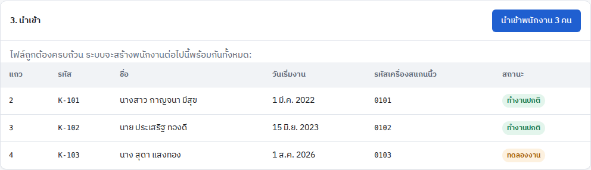

ระบบจะสร้างทุกคนในไฟล์พร้อมกันในครั้งเดียว ถ้าพนักงานลาไปแล้วในปีนี้ ให้กด
**นำเข้าวันลาที่ใช้ไปแล้ว** เพื่อทำข้อ 2 ต่อได้เลย

การนำเข้าไม่ได้สร้างบัญชีเข้าใช้งานให้พนักงาน และนำเข้าคนที่มีรหัสพนักงานอยู่ในระบบแล้วซ้ำไม่ได้
ระบบจะแจ้งว่ารหัสไหนมีอยู่แล้ว

---

## 2. นำเข้าวันลาที่ใช้ไปแล้ว

ใช้เมื่อพนักงานลาไปแล้วในปีนี้ก่อนเริ่มใช้ Cwork เพื่อให้วันลาคงเหลือตั้งต้นถูกต้อง

### เปิดหน้า

ไปที่เมนู **การลา** แล้วกดปุ่ม **นำเข้าวันลาที่ใช้ไปแล้ว** ที่มุมขวาบน

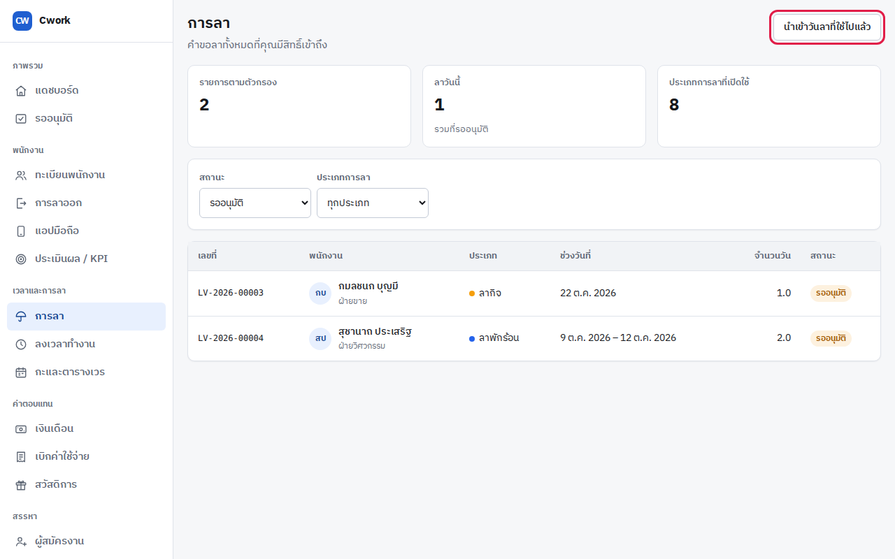

### กรอกแบบฟอร์ม

กด **แบบฟอร์มภาษาไทย** แบบฟอร์มมีรายชื่อพนักงานทุกคนและประเภทการลาครบแล้ว
กรอกแค่**จำนวนวันที่แต่ละคนใช้ไป**ในช่องของประเภทการลา

- กรอกเป็นตัวเลข เช่น `3` หรือ `0.5` สำหรับครึ่งวัน
- **ช่องว่าง = ไม่เปลี่ยนแปลง** ส่วน `0` = ยังไม่ได้ลาเลย
- ลบแถวหรือคอลัมน์ที่ไม่ใช้ได้ แต่ห้ามแก้รหัสพนักงานหรือชื่อหัวคอลัมน์
- นำเข้าซ้ำได้ ระบบจะใช้ตัวเลขล่าสุดแทนของเดิม **ไม่บวกเพิ่ม**

### อัปโหลดและแก้จุดที่ผิด

ระบบจะตรวจว่าจำนวนวันไม่เกินสิทธิ์ของแต่ละคน และรหัสพนักงานมีอยู่จริง

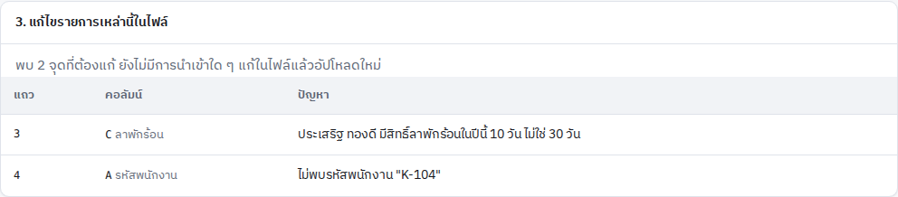

### ตรวจแล้วนำเข้า

หน้าจอจะแสดงวันที่ใช้ไปและ**วันลาคงเหลือหลังนำเข้า**ของแต่ละคน ให้เทียบกับที่บันทึกไว้เดิม
ถ้าถูกต้อง กด **นำเข้าวันลาของพนักงาน … คน** ช่องที่เป็นขีด (—) คือช่องที่เว้นว่างไว้ ระบบไม่เปลี่ยนตัวเลขของช่องนั้น

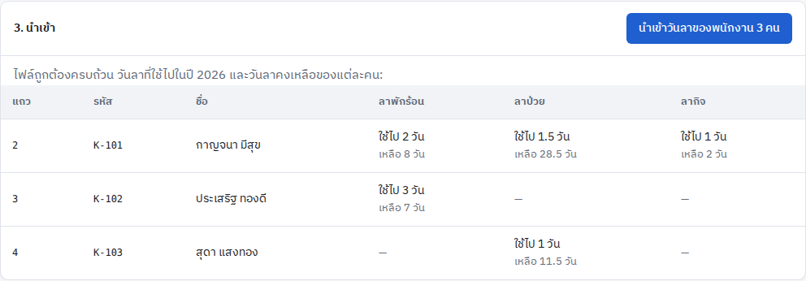

---

## 3. นำเข้ายอดเงินเดือนก่อนใช้ Cwork

ใช้เมื่อบริษัทเริ่มคำนวณเงินเดือนใน Cwork กลางปี ระบบต้องรู้ยอดที่จ่ายไปแล้วตั้งแต่มกราคม
เพื่อหักภาษีเดือนต่อ ๆ ไปให้ถูก และให้แบบยื่นสิ้นปีนับครบทั้งปี

### เปิดหน้า

ไปที่เมนู **เงินเดือน** แล้วกดปุ่ม **นำเข้ายอดเงินเดือนก่อนใช้ Cwork** ที่มุมขวาบน

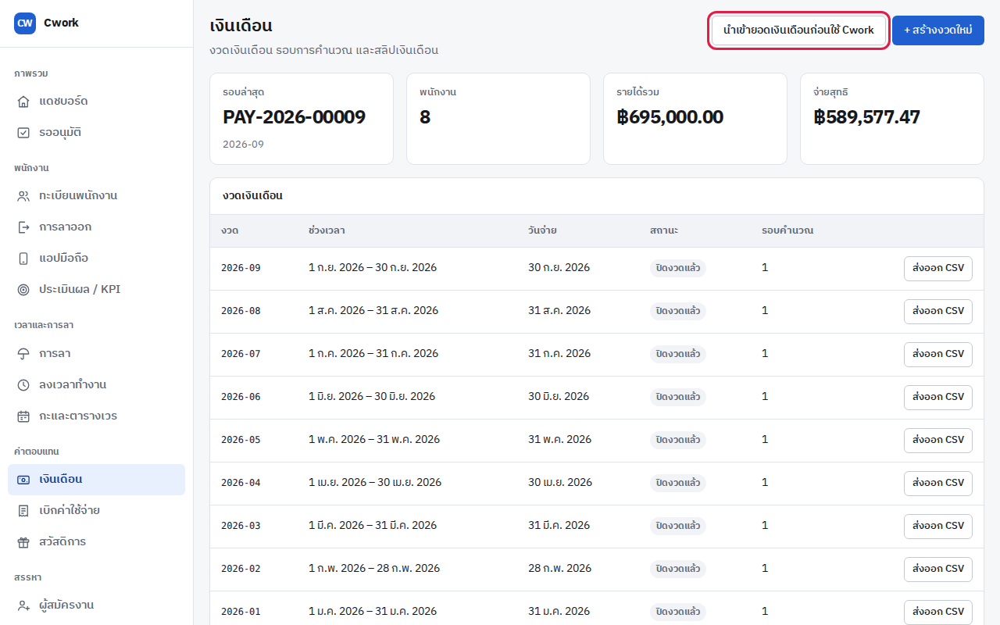

### เลือกเดือน

เลือก**เดือนสุดท้ายที่ระบบเดิมจ่ายเงินเดือน** Cwork จะเริ่มจ่ายตั้งแต่เดือนถัดไป
**เลือกเดือนก่อนดาวน์โหลดแบบฟอร์ม** เพราะแบบฟอร์มจะทำตามเดือนที่เลือก
ถ้าเปลี่ยนเดือนทีหลัง ต้องดาวน์โหลดแบบฟอร์มและอัปโหลดใหม่

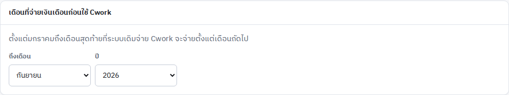

### กรอกแบบฟอร์ม

แบบฟอร์มมีรายชื่อพนักงานที่ทำงานในช่วงนั้นครบแล้ว กรอก**ยอดรวมตั้งแต่มกราคมถึงเดือนที่เลือก**
ของแต่ละคน สามช่อง

| ช่อง | กรอกอะไร |
|---|---|
| เงินได้ที่ต้องเสียภาษี | เงินได้ตามมาตรา 40(1) รวมทุกเดือน เช่น เงินเดือน ค่าล่วงเวลา โบนัส |
| ภาษีหัก ณ ที่จ่าย | ภาษีที่หักไว้แล้วรวมทุกเดือน |
| ประกันสังคม (ส่วนลูกจ้าง) | เฉพาะส่วนที่หักจากลูกจ้าง ไม่รวมส่วนที่นายจ้างสมทบ |

- ถ้ากรอกคนไหน ต้องกรอกครบทั้งสามช่อง ช่องที่ไม่มีให้ใส่ `0`
- แถวที่ว่างทั้งสามช่อง = ไม่เปลี่ยนแปลง
- ใส่เฉพาะเงินที่**บริษัทนี้**จ่าย ไม่รวมรายได้จากนายจ้างเดิมของพนักงาน
- นำเข้าซ้ำได้ ระบบจะใช้ตัวเลขล่าสุดแทนของเดิม ไม่บวกเพิ่ม

### อัปโหลดและแก้จุดที่ผิด

ระบบตรวจ เช่น ภาษีต้องไม่มากกว่าเงินได้ และประกันสังคมต้องไม่เกินเพดานของจำนวนเดือนนั้น

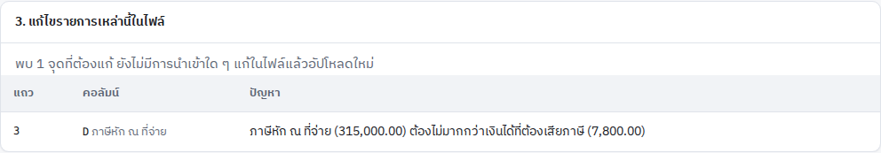

### ตรวจแล้วนำเข้า

ตรวจยอดของแต่ละคนและแถว **รวม** ด้านล่างให้ตรงกับรายงานของระบบเดิม แล้วกด **นำเข้ายอดของพนักงาน … คน**
คนที่เคยนำเข้าไว้แล้วจะมีป้าย **แทนตัวเลขเดิม**

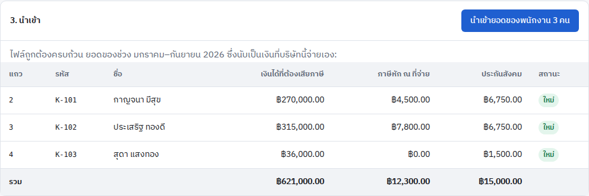

หลังนำเข้า หน้าจอจะบอกว่าให้เริ่มคำนวณเงินเดือนใน Cwork ตั้งแต่เดือนไหน
ถ้ามีรอบเงินเดือนที่คำนวณไว้ก่อนนำเข้ายอดเหล่านี้ ระบบจะเตือนให้คำนวณรอบนั้นใหม่ก่อนอนุมัติ
เพราะภาษีที่หักจะต่ำเกินไป

---

## ปัญหาที่เจอบ่อย

| ข้อความที่เห็น | แปลว่า | วิธีแก้ |
|---|---|---|
| ไม่รู้จักคอลัมน์ "…" | หัวคอลัมน์ไม่ตรงกับแบบฟอร์ม มักเกิดกับไฟล์ที่ส่งออกจากระบบเดิม | ลบคอลัมน์นั้น หรือแก้ชื่อหัวคอลัมน์ให้ตรงกับแบบฟอร์ม |
| ไม่พบแผนก "…" (หรือตำแหน่ง สถานที่ทำงาน) | ชื่อที่กรอกไม่ตรงกับที่มีในระบบ หรือระบบยังไม่มีชื่อนี้ | ตรวจตัวสะกด ถ้ายังไม่มีในระบบ ให้เพิ่มที่เมนู **โครงสร้างองค์กร** (ปุ่ม **เพิ่มแผนก** **เพิ่มตำแหน่ง** หรือ **เพิ่มสถานที่ทำงาน**) แล้วอัปโหลดไฟล์เดิมอีกครั้ง ถ้าไม่เห็นปุ่มเหล่านี้ แปลว่าบัญชีของคุณไม่มีสิทธิ์ ให้แจ้งผู้ดูแลระบบ |
| "…" ไม่ใช่วันที่ที่ระบบอ่านได้ | วันที่ผิดรูปแบบ หรือไม่มีวันนั้นจริง เช่น 31/9 | ใช้รูปแบบ `15/1/2567` หรือ `2024-01-15` |
| Excel ย่อตัวเลขนี้เป็น "…" ไปแล้ว | Excel เปลี่ยนตัวเลขยาว ๆ เป็นแบบย่อ (เช่น 1.23E+12) | ตั้งรูปแบบคอลัมน์เป็นข้อความ (Text) แล้วพิมพ์ใหม่ |
| "…" ซ้ำกับแถว … | รหัสเดียวกันอยู่ในไฟล์มากกว่าหนึ่งแถว | เหลือไว้แถวเดียว หรือแก้รหัสให้ถูก |
| มีรหัสพนักงาน … อยู่ในระบบแล้ว | คนนี้ถูกนำเข้าไปแล้ว | ลบแถวนี้ออกจากไฟล์ |
| ต้องมีชื่อ เป็นภาษาไทยหรือภาษาอังกฤษก็ได้ | แถวนี้ไม่มีทั้งชื่อภาษาไทยและภาษาอังกฤษ | กรอกชื่อและนามสกุลภาษาไทย หรือภาษาอังกฤษสำหรับแรงงานต่างด้าว |
| … มีสิทธิ์…ในปีนี้ … วัน ไม่ใช่ … วัน | จำนวนวันที่กรอกเกินสิทธิ์ ถ้าสิทธิ์เป็น 0 วัน แปลว่าคนนี้ยังไม่มีสิทธิ์ลาประเภทนั้น | ตรวจตัวเลขกับบันทึกเดิม ถ้าสิทธิ์เป็น 0 ให้เว้นช่องนั้นว่าง |
| ไม่พบรหัสพนักงาน "…" | ยังไม่ได้นำเข้าพนักงานคนนี้ หรือรหัสพิมพ์ผิด | นำเข้าพนักงานก่อน (ข้อ 1) หรือแก้รหัส |
| ต้องกรอก (ในหน้ายอดเงินเดือน) | กรอกบางช่องแต่ไม่ครบสามช่อง | ช่องที่ไม่มีให้ใส่ `0` |
| … ได้รับเงินเดือนงวด … ใน Cwork แล้ว | คนนี้มีรอบเงินเดือนใน Cwork แล้วตั้งแต่เดือนนั้น | เลือกเดือนให้ก่อนหน้านั้น หรือลบแถวนี้ออก |

ถ้าเจอข้อความที่ไม่อยู่ในตารางนี้ ให้ถ่ายภาพหน้าจอทั้งหน้าส่งให้ผู้ดูแลระบบ
